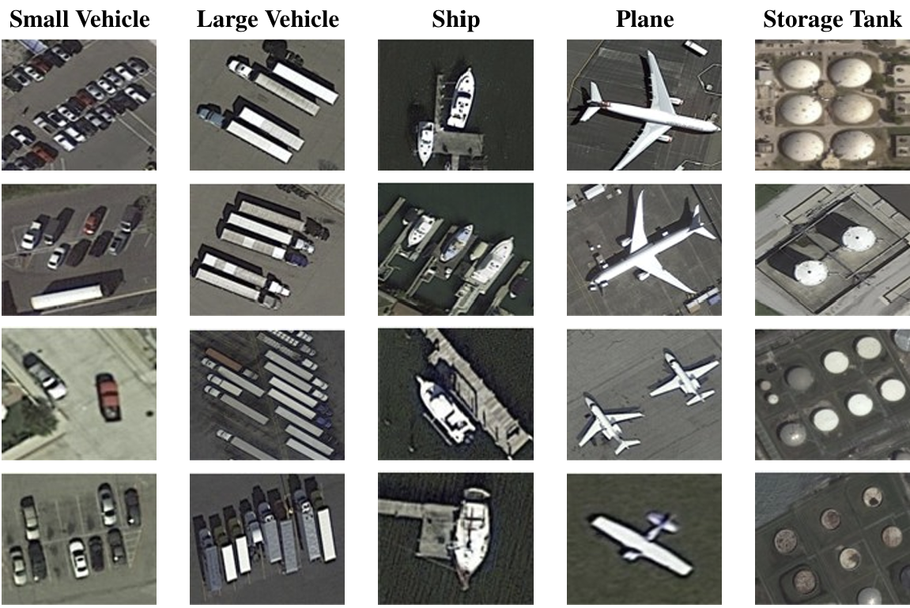
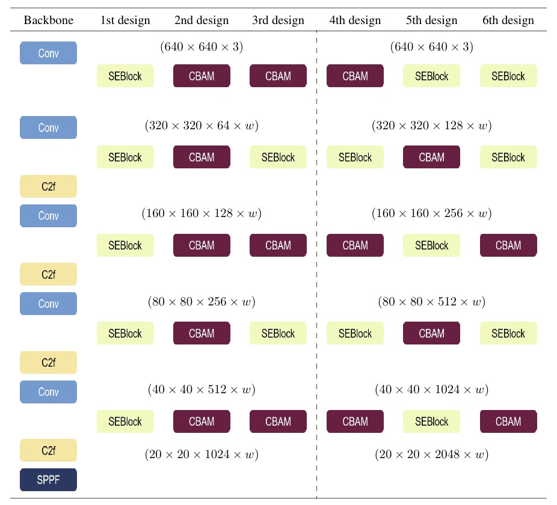
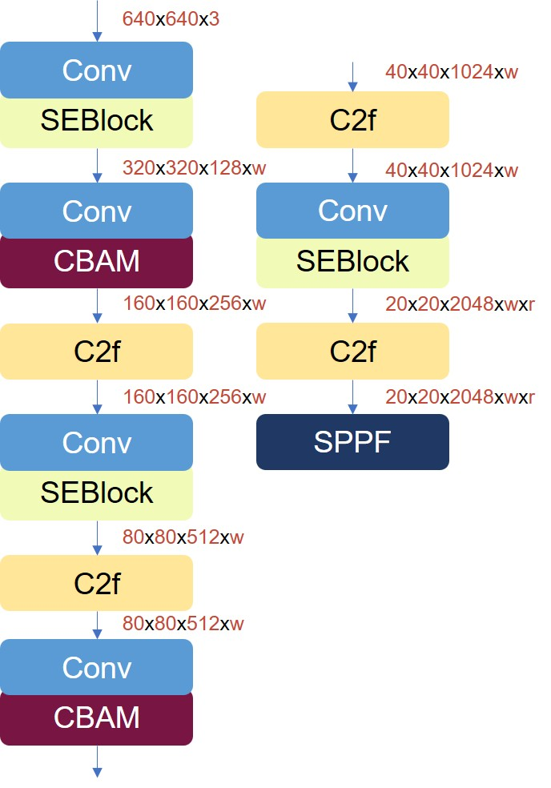

# MoonNet
Enhanced Detection of Tiny Objects in Aerial Images

## Dataset
<p align="center">
  
  <br>
  <em>Modified DOTAv2.0</em>
</p>

## Backbone Designs
<p align="center">
  
  <br>
  <em>Six attention-augmented backbone designs</em>
</p>

## Mixture of Orthogonal Neural Network (MoonNet)
<p align="center">
  
  <br>
  <em>MoonNet backbone design</em>
</p>

## Dataset Preparation

### DOTA
Download and prepare the original DOTAv2.0 dataset same as the below folder hierarchy and also create the output folder where the modified dataset will be stored.
```
DOTAv2.0(Original)/
├── train/
│ ├── images/
│ | ├── P0000.png
| | | ...
│ └── labels/
│ | ├── P0000.txt 
| | | ...
|
└── val/
│ ├── images/
│ | ├── P0003.png
| | | ...
│ └── labels/
│ | ├── P0003.txt 
| | | ...
```
Then run this python code
```python
python dota2YOLO.py \
--dota_root /path/to/DOTA-v2.0(Original) \
--out /path/to/modified_dota_v2(Output) \
#for HBB extraction,
--export_coco
#for OBB extraction,
--obb
```
If you want to check the pixel size of each object categories after modification, you run check the average sizes by running this code
```python
python avg_pixel_size.py \
--root "root_to_your_file" \
#for training set
--split train
#for validation set
--split val
```

### VisDrone
Download and prepare the original VisDrone2019 dataset same as the below folder hierarchy and also create the output folder where the modified dataset will be stored.
```
VisDrone2019(Original)/
├── VisDrone2019-DET-train/
│ ├── images/
│ | ├── 0000002_00005_d_0000014.jpg
| | | ...
│ └── annotations/
│ | ├── 0000002_00005_d_0000014.txt 
| | | ...
|
└── VisDrone2019-DET-val/
│ ├── images/
│ | ├── 0000001_02999_d_0000005.jpg
| | | ...
│ └── annotations/
│ | ├── 0000001_02999_d_0000005.txt 
| | | ...
```

Then run this python code
```python
python VisDrone2YOLO_HBB.py \
--dota_root /path/to/VisDrone2019(Original) \
--out /path/to/VisDrone2YOLO(Output) \
--split train val
```

## Training
To conduct a training using the modified DOTAv2.0, run this command
```python
yolo obb train cfg='direction/to/your/config.yaml'
```

To conduct a training using the VisDrone2019, run this command
```python
yolo detect train cfg='direction/to/your/config.yaml'
```

## Evaluating
Evaluating using modified DOTA
```python
tools/python eval.py
```
Evaluating using VisDrone
```python
tools/python eval_visdrone.py
```
Visual predictions
```python
tools/python vis_YOLOv8.py
```
